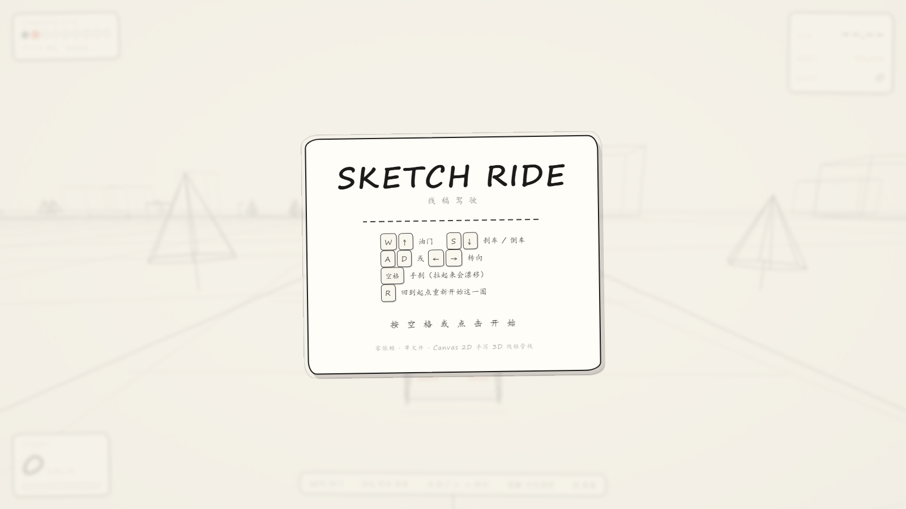
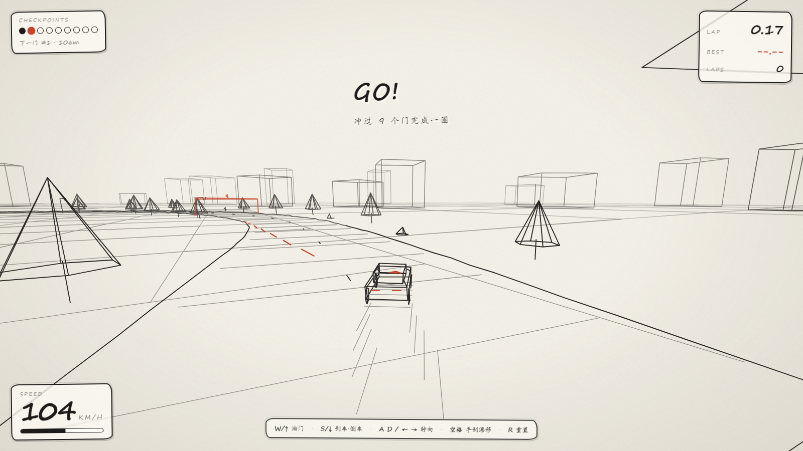

# SKETCH RIDE · 线稿驾驶

一个**纯手绘线稿风格**的 3D 驾驶小游戏。白纸作底、墨线勾边、橙红强调，全程「铅笔草稿」质感。
零依赖、单文件、双击 `index.html` 即玩。

🌐 **线上试玩（GitHub Pages）**：[https://5631723.github.io/sketch-ride/](https://5631723.github.io/sketch-ride/)

## 玩法

9 个检查点拱门组成的计时赛，赛道周长约 1062m。按顺序冲过每个检查点门，跑完一圈即记录单圈时间，
刷新最佳圈速。极速约 180 km/h，漂移会在路面留下铅笔痕迹。

## 操作

| 按键 | 功能 |
| --- | --- |
| `W` / `↑` | 油门 |
| `S` / `↓` | 刹车 / 倒车 |
| `A` `D` / `← →` | 转向 |
| `空格` | 手刹漂移 |
| `R` | 重置到起点 |

> 彩蛋：URL 加 `?auto=1&drive=1` 可跳过开始遮罩直接开跑；`&spd=30` 设初始车速、`&h=0.45` 给车头一个偏转角（便于演示漂移）。

## 技术说明

渲染**没有用 Three.js**。线稿风本质上只需要「投影 + 画线」，光照、材质、着色器全用不上，
所以手写了一个轻量 Canvas 2D 的 3D 管线：

- **相机矩阵 → 近平面裁剪 → 透视投影**：把世界坐标投到屏幕。
- **贴脸剔除**：相机擦着物体掠过时丢弃线段，避免横跨屏幕的丑线。
- **按深度分 6 层合批**：每层一次 `stroke()` 调用，约 4000 条线段稳定 60fps。
- **屏幕空间低频抖动**：用世界坐标哈希做手绘颤动 seed，共享端点的线永不裂开。

车辆物理是街机式模型：纵横向速度分解 + 抓地衰减实现漂移，出界减速，第三人称跟随相机。

## 运行

直接用浏览器打开 `index.html` 即可，无需任何构建步骤或依赖。

## 已知限制

- 树木、路障没有碰撞体（出界只减速）。
- 手写体字体在部分系统会回退为普通字体，风格略有折扣。
