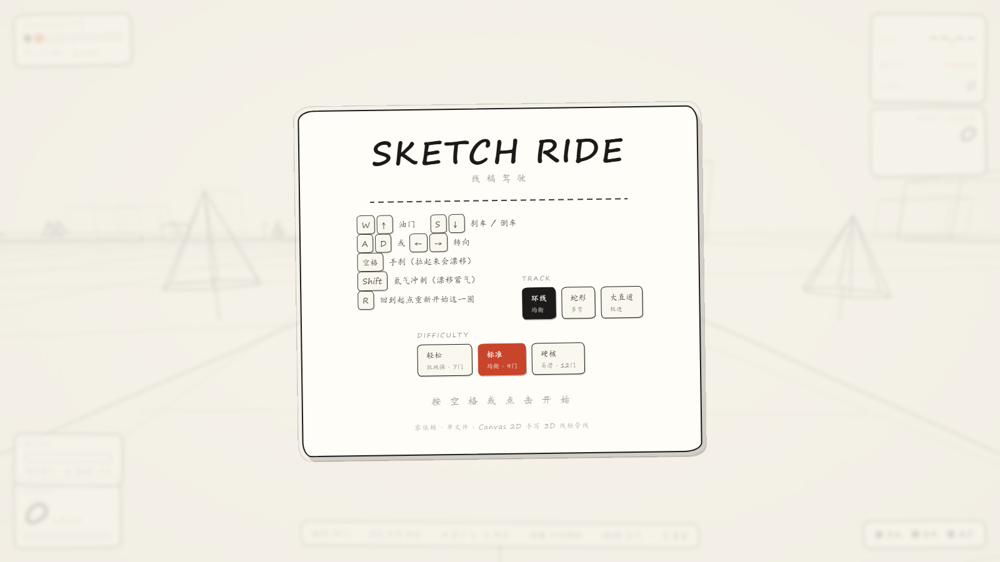
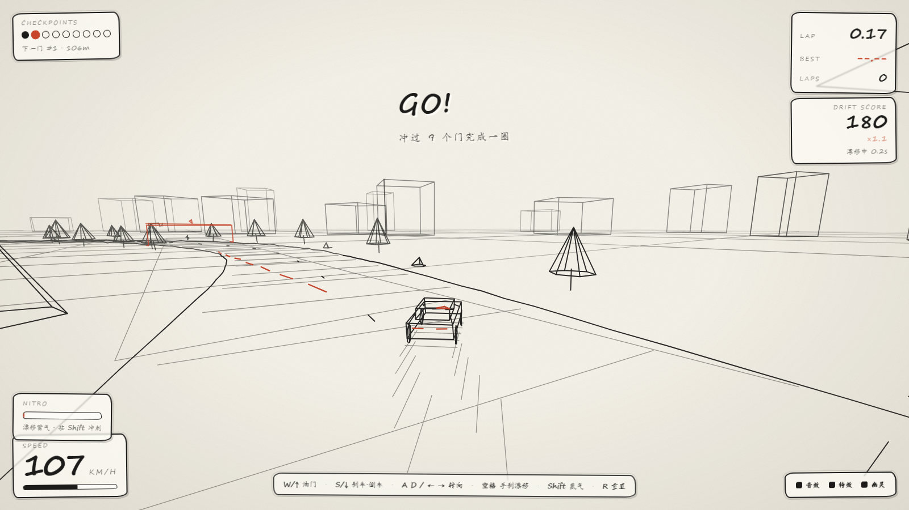

# SKETCH RIDE · 线稿驾驶

一个**纯手绘线稿风格**的 3D 驾驶小游戏。白纸作底、墨线勾边、橙红强调，全程「铅笔草稿」质感。
零依赖、单文件、双击 `index.html` 即玩。

🌐 **线上试玩（GitHub Pages）**：[https://5631723.github.io/sketch-ride/](https://5631723.github.io/sketch-ride/)

> v2 · 3 赛道 × 3 难度 · 漂移计分 · 氮气 · 幽灵车 · 本地排行榜

## 玩法

3 条赛道 × 3 档难度（检查点 7/9/12 门），计时赛 + **漂移计分** 双轨玩法：

- **漂移评分**：横滑越快、持续越久分越高，连击倍率最高 ×4，漂移结束结算弹字
- **氮气冲刺**：漂移蓄气、冲检查点门回气，`Shift` 释放可突破极速 32%
- **幽灵车**：跑出最佳圈后，下一圈有半透明橙线幽灵按原节奏回放，跟自己较劲
- **碰撞**：树、轮胎堆、路灯全有碰撞体，撞上弹开掉速、镜头震动
- **本地排行榜**：每条「赛道×难度」独立保存前 8 名（localStorage）

## 操作

| 按键 | 功能 |
| --- | --- |
| `W` / `↑` | 油门 |
| `S` / `↓` | 刹车 / 倒车 |
| `A` `D` / `← →` | 转向 |
| `空格` | 手刹漂移 |
| `Shift` | 氮气冲刺 |
| `R` | 重置到起点 |

> 彩蛋：URL 加 `?auto=1&drive=1` 跳过遮罩直接开跑；`&track=1&diff=2` 选赛道难度；`&spd=30&h=0.5` 演示漂移；`&nitro=1&boost=1` 满氮气喷射。

## 技术说明

渲染**没有用 Three.js**。线稿风本质上只需要「投影 + 画线」，光照、材质、着色器全用不上，
所以手写了一个轻量 Canvas 2D 的 3D 管线：

- **相机矩阵 → 近平面裁剪 → 透视投影**：把世界坐标投到屏幕。
- **贴脸剔除**：相机擦着物体掠过时丢弃线段，避免横跨屏幕的丑线。
- **按深度分 6 层合批**：每层一次 `stroke()` 调用，约 1.5 万条线段稳定 60fps。
- **屏幕空间低频抖动**：用世界坐标哈希做手绘颤动 seed，共享端点的线永不裂开。
- **场景可重建**：赛道/难度切换时整条世界（样条→网格→道具→碰撞体→检查点）一键重生成。

车辆物理是街机式模型：纵横向速度分解 + 抓地衰减实现漂移；`vl` 横向速度同时驱动
漂移判定、痕迹、粒子与音效。音效全部 WebAudio 实时合成（双振荡器引擎 + 带通白噪胎声），零素材。

## 运行

直接用浏览器打开 `index.html` 即可，无需任何构建步骤或依赖。
或访问线上版：**https://5631723.github.io/sketch-ride/**

## 已知限制

- 手写体字体在部分系统会回退为普通字体，风格略有折扣。
- 幽灵车与排行榜存 localStorage，换浏览器/清缓存会丢。

---

_最后更新：2026-09-16_
